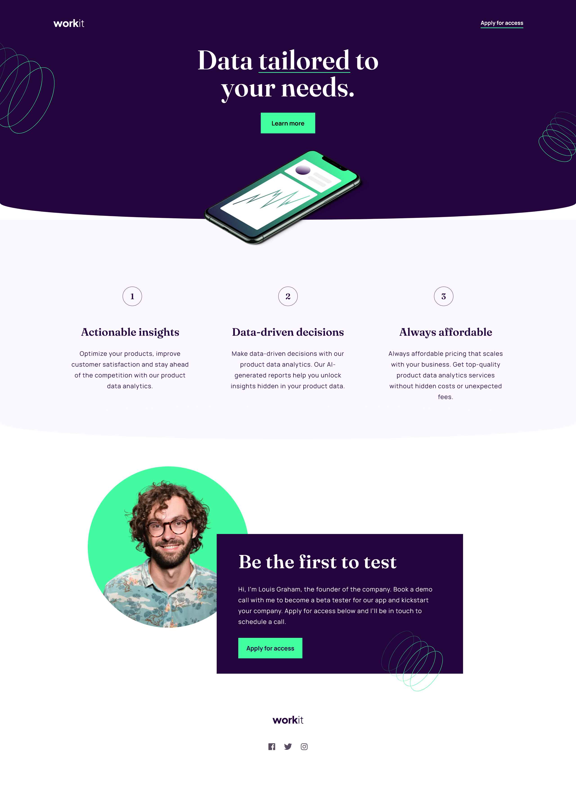

# Frontend Mentor - Workit landing page solution

This is a solution to the [Workit landing page challenge on Frontend Mentor](https://www.frontendmentor.io/challenges/workit-landing-page-2fYnyle5lu). Frontend Mentor challenges help you improve your coding skills by building realistic projects. 

## Table of contents

- [Overview](#overview)
  - [The challenge](#the-challenge)
  - [Screenshot](#screenshot)
  - [Links](#links)
- [My process](#my-process)
  - [Built with](#built-with)
  - [What I learned](#what-i-learned)
  - [Continued development](#continued-development)
- [Author](#author)

## Overview

### The challenge

Users should be able to:

- View the optimal layout for the interface depending on their device's screen size
- See hover and focus states for all interactive elements on the page

### Screenshot

### Links

- Solution URL: [https://www.frontendmentor.io/solutions/workit-landing-page-Sa5Pd8V8LP](workit-solution-page)
- Live Site URL: [https://workit-landing-page-vert.vercel.app/](workit-landing-page)

## My process

### Built with

- Semantic HTML5 markup
- CSS custom properties
- Flexbox

### What I learned

Took me around 8 hours to finish this one. This one was a doozie, getting the curved elements and positioning the images made me pulled my hair out. I originally had the top swirly images in a Flexbox with the middle blurb and phone image, but the right image made the page scroll right to reveal white space after spending an hour trying to figure out how to remove the white space without messing up the curved element and the phone overhang, I move the images to be parented to main instead of the hero section to escape the overhand property.

I used z-index to get them back over the hero section. This would allow me to keep my curved element(which took many hours to figure out) and the swirly designs. Ending up getting white space again when everything was said on done the upper right swirl worked before and now it stopped even though I had overflow set as hidden, so I just downloaded the cut off version from figma.

When working on the tablet design I noticed that the middle section was laid out differently so I have to add the h3 and paragraphs under the numbers into their own flexbox so I could get the mobile design down. A lot of trial and error. So in all, getting initial layout took only 90 minutes and getting the curve and swirls down took many hours :) Next time I'm just going to use a SVG.

After this, I'm going to focus more on responsiveness of flex as the site works at the breakpoints, but not really in the in-betweens, so I believe I've been going about it in the wrong manner, going to mess around with max H and W values next time to see if that will be more responsive. Also going to try SCSS next so I can compartmentalize the CSS when dealing with the Media Queries so I can reduce the size as I was getting a little cross-eyed with all the lines of CSS.

### Continued development

Going to focus on responsiveness, I don't believe this page is responsive enough

## Author

- Frontend Mentor - [@tbeagle2](https://www.frontendmentor.io/profile/tbeagle2)

